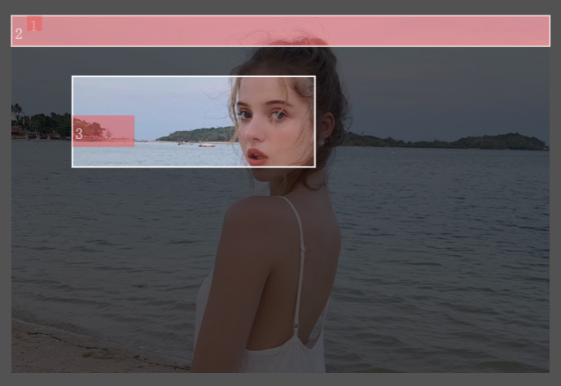

# Img-Mark

在一个图片中标记一个或者多个截图区域

在截图区域中标记一个或者多个子区域

如下图：



## 使用

### 引入样式

```ts
//main.ts
import 'img-mark/dist/style.css'
```

### 示例

```vue
<template>
	<div class="page-test-img-mark">
		<div style="width: 50vw; height: 100vh; background: #ccc; box-sizing: border-box; flex-shrink: 0">
			<ImgMark
				ref="imgMarkRef"
				:src="src"
				v-model:mode="mode"
				v-model:tagList="tagList"
				v-model:cropList="cropList"
				@tagsStatusChange="tagsStatusChange"
				:enableDrawCropOutOfImg="false"
				:enableDrawTagOutOfCrop="false"
				:enableDrawTagOutOfImg="false"
			></ImgMark>
		</div>
		<div class="info-panel">
			<el-input v-model="src"></el-input>
			<el-button type="primary" size="small" style="margin-top: 40px" @click="getGroupInfo()">getGroupInfo</el-button>
			<el-alert
				v-for="item in tagList"
				@close="removeTag([item])"
				@mouseenter="setHoverItem(item)"
				@mouseleave="removeHoverItem(item)"
				style="margin-top: 20px"
				:key="uid(6)"
				:title="JSON.stringify(item)"
				type="warning"
			>
			</el-alert>
		</div>
	</div>
</template>
<script setup lang="ts">
import { ImgMark, Mode, BoundingBox } from 'img-mark'
import { uid } from 'uid'
let src = $ref('https://forza.ismcdn.jp/mwimgs/8/e/1774n/img_8e8307dc5355e41385fd3568ef95f233218536.jpg')
let mode = $ref<Mode>('crop')
let cropList = $ref<BoundingBox[]>([
	{
		startX: 0,
		startY: 0,
		endX: 1774,
		endY: 100,
	},
	{
		startX: 200,
		startY: 200,
		endX: 1000,
		endY: 500,
	},
])

let tagList = $ref<BoundingBox[]>([
	{
		startX: 50,
		startY: 0,
		endX: 100,
		endY: 50,
		isShow: true,
		labelText: 'customTagLabelText',
	},
	{
		startX: 0,
		startY: 0,
		endX: 1774,
		endY: 100,
		isShow: true,
	},
])

let imgMarkRef = $ref<InstanceType<typeof ImgMark>>()

function removeTag(data?: BoundingBox[]) {
	if (data) {
		imgMarkRef.removeTagItems(data)
	}
}
function cropChange() {
	removeTag()
}

function setHoverItem(item: BoundingBox) {
	item.showOutLine = true
}
function removeHoverItem(item: BoundingBox) {
	item.showOutLine = false
}

function tagsStatusChange(list: BoundingBox[]) {
	let removeList = list.filter(i => !i.type)
	if (removeList.length !== 0) {
		removeTag(removeList)
	}
}

function getGroupInfo() {
	let groupInfo = imgMarkRef.getTagListGroupByCropIndex()
	console.log(groupInfo)
}
</script>
<style scoped lang="scss">
.page-test-img-mark {
	display: flex;
	justify-content: space-between;
	.info-panel {
		width: 50vw;
		box-sizing: border-box;
		padding: 20px;
	}
}
</style>
```

## 类型

```ts
type BoundingBox = {
	startX: number
	endX: number
	startY: number
	endY: number
	isShow?: boolean //tag是否显示
	showOutLine?: boolean //tag是否边框是否高亮
	labelText?: string //tag的标签文字
}

type CropConfig = {
	lineDash?: number[]
	strokeStyle?: string
	lineWidth?: number
}

type LayerConfig = {
	fillStyle?: string
}

type TagConfig = {
	fillStyle?: string
	textFillStyle?: string
	hoverStrokeStyle?: string
	hoverLineWidth?: number
	hoverLineDash?: number[]
	highlightStrokeStyle?: string
	highlightLineWidth?: number
	highlightLineDash?: number[]
}

type ResizeEmitType = {
	index: number
	box: BoundingBox
}

type TagListGroupByCropIndex = {
	[key: number]: BoundingBox[]
	undefined: BoundingBox[]
}
```

## 组件属性

| 属性                                    | 说明                                                                                                                                                 | 类型          | 可选值       | 默认值 |
| --------------------------------------- | ---------------------------------------------------------------------------------------------------------------------------------------------------- | ------------- | ------------ | ------ |
| src                                     | 图片地址, 必选参数                                                                                                                                   | string        | ——           | ——     |
| mode/v-model:mode                       | 模式                                                                                                                                                 | string        | crop/tag     | crop   |
| mobileOperation/v-model:mobileOperation | 移动端单指在画布滑动是移动还是画 rect                                                                                                                | string        | move/draw    | move   |
| cropList/v-model:cropList               | 裁切区域集合，相对于`img`左上角开始定位                                                                                                              | BoundingBox[] | ——           | []     |
| tagList/v-model:tagList                 | tag 区域集合,相对于`img`左上角开始定位                                                                                                               | BoundingBox[] | ——           | []     |
| precision                               | BoundingBox 精度                                                                                                                                     | number        | ——           | 0      |
| enableScale                             | 是否允许缩放画布                                                                                                                                     | boolean       | true/false   | true   |
| enableMove                              | 是否允许移动画布                                                                                                                                     | boolean       | true/false   | true   |
| enableDrawCrop                          | 是否允许在画布上画 `crop`                                                                                                                            | boolean       | true/false   | true   |
| enableDrawTag                           | 是否允许在画布上画 `tag`                                                                                                                             | boolean       | true/false   | true   |
| enableInteractiveTagChangeStatus        | 是否允许交互改变 `tag` 状态                                                                                                                          | boolean       | true/false   | true   |
| enableInteractiveCropDelete             | 是否允许交互删除 `crop`                                                                                                                              | boolean       | true/false   | true   |
| enableDrawCropOutOfImg                  | 是否允许 `crop` 画到图片外                                                                                                                           | boolean       | true/false   | true   |
| enableDrawTagOutOfCrop                  | 是否允许 `tag` 画到 `crop` 外                                                                                                                        | boolean       | true/false   | true   |
| enableDrawTagOutOfImg                   | 是否允许 `tag` 画到图片外                                                                                                                            | boolean       | true/false   | true   |
| enableCropResize                        | 是否允许 `crop` 改变大小                                                                                                                             | boolean       | true/false   | true   |
| enableCropCross                         | 是否允许 `crop` 和其他 `crop` 相交,不允许后，如果相交，新画的`crop`会不添加，如果是 resize 操作相交以后，按照下方 `handleResizeCropCross` 属性去处理 | boolean       | true/false   | true   |
| handleResizeCropCross                   | 当`enableCropCross`属性为 false，resize 操作相交后该如何处理进行 resize 操作的`crop`                                                                 | string        | delete/reset | reset  |
| isShowTip                               | 是否显示底部提示区域                                                                                                                                 | boolean       | true/false   | false  |
| layerConfig                             | 浮层样式                                                                                                                                             | LayerConfig   | ——           | ——     |
| cropConfig                              | `crop` 样式                                                                                                                                          | CropConfig    | ——           | ——     |
| tagConfig                               | `tag` 样式                                                                                                                                           | TagConfig     | ——           | ——     |

## 组件事件

| 事件名         | 说明                                                                                   | 参数                                                                              |
| -------------- | -------------------------------------------------------------------------------------- | --------------------------------------------------------------------------------- |
| tagListChange  | 当添加或者删除或者改变组件状态 `tag` 项触发,`parentCrop` 只在 `type` 为 `add` 时候返回 | {type:'add'/'delete'/'statusChange', list:BoundingBox[],parentCrop?:BoundingBox } |
| cropListChange | 当添加或者删除或者改变 `crop` 大小触发                                                 | {type:'add'/'delete'/'resize', list:BoundingBox[] }                               |
| resizeStart    | `crop` 开始 resize 触发                                                                | data:ResizeEmitType                                                               |
| resizeEnd      | `crop` 结束 resize 触发                                                                | data:ResizeEmitType                                                               |
| delCrop        | 删除 `crop` 触发                                                                       | list:BoundingBox[]                                                                |

## 组件方法

| 方法                       | 说明                                 | 参数                                      | 返回类型                |
| -------------------------- | ------------------------------------ | ----------------------------------------- | ----------------------- |
| removeTagItems             | 移除 `tag` 项                        | list:BoundingBox[]                        | void                    |
| getTagListGroupByCropIndex | 获取 `tagList` 并按照 cropIndex 分组 | type: 'startPoint'/'allIn' = 'startPoint' | TagListGroupByCropIndex |

## Slots

| 插槽名 | 说明                 |
| ------ | -------------------- |
| tip    | 右下角提示自定义内容 |

## Lib 方法

| 方法                          | 说明                           | 参数                                                              | 返回类型      |
| ----------------------------- | ------------------------------ | ----------------------------------------------------------------- | ------------- |
| transformTagListBoxRelativeTo | 转换 `tag` list 基于什么去定位 | type: 'img'/'crop', cropInfo: BoundingBox, tagList: BoundingBox[] | BoundingBox[] |
| transformTagBoxRelativeTo     | 转换单个 `tag` 基于什么去定位  | type: 'img'/'crop', cropInfo: BoundingBox, tag: BoundingBox       | BoundingBox   |
| boxIsAllInOtherBox            | box 是否完全包含在另一个 box   | box: BoundingBox, otherBox: BoundingBox                           | boolean       |

## 操作

### 移动画布

按住鼠标左键拖动

### 画区域

按下空格 + 按住鼠标左键拖动

### 切换模式

Ctrl + B

### 放大缩小

鼠标滚轮
